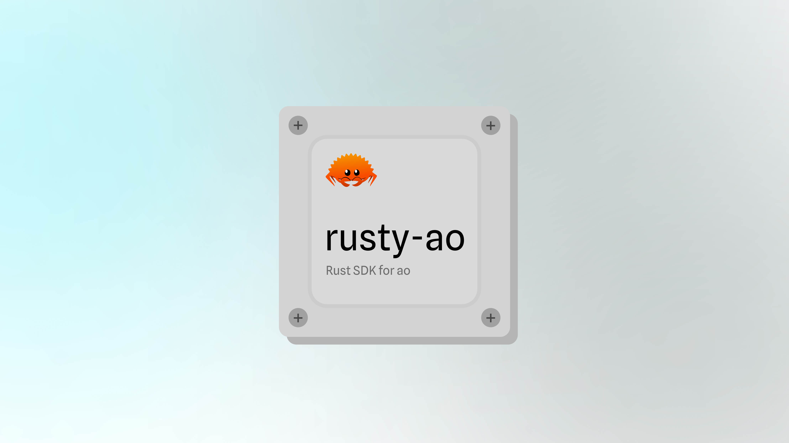

<p align="center">
  <a href="https://wvm.dev">
    
  </a>
</p>

## About
A blazingly fast client for [AO](https://ao.arweave.dev) written in Rust.

## Install

```bash
cargo add rusty_ao
```

Alternatively, in your `Cargo.toml`, add:

```Cargo.toml
[dependencies]
ao = { git = "https://github.com/weaveVM/rusty-ao.git", branch = "main" }
```

## Usage Examples

### Init an AO client

```rust
let ao = Ao::new(
  "https://mu.ao-testnet.xyz".to_string(),
  "https://cu.ao-testnet.xyz".to_string(),
  SignerTypes::Arweave("test_key.json".to_string()),
  )
  .unwrap();
```

or using the `default_init` method

```rust
let ao = Ao::default_init(SignerTypes::Arweave("test_key.json".to_string()))
  .unwrap();
```
### Dry run an AO process message call

```rust
// let ao = ...init AO...

let res = ao
    .dry_run(
        "xU9zFkq3X2ZQ6olwNVvr1vUWIjc3kXTWr7xKQD6dh10".to_string(),
        "".to_string(),
        vec![Tag {
            name: "Action".to_string(),
            value: "Info".to_string(),
        }],
    )
    .await;

assert!(res.is_ok());
println!("{}", serde_json::to_string(&res.unwrap()).unwrap());
```

### Spawn a new process

```rust
// let ao = ...init AO...

let res = ao
    .spawn(
        "test1".to_string(),
        "rusty-ao".to_string(),
        DEFAULT_MODULE.to_string(),
        DEFAULT_SCHEDULER.to_string(),
        vec![],
    )
    .await;

println!("{:?}", res);
assert!(res.is_ok());
println!("{}", serde_json::to_string(&res.unwrap()).unwrap());
```
### Request CU get process result

```rust
// let ao = ...init AO...

let res = ao
    .get(
        "ya9XinY0qXeYyf7HXANqzOiKns8yiXZoDtFqUMXkX0Q".to_string(),
        "5JtjkYy1hk0Zce5mP6gDWIOdt9rCSQAFX-K9jZnqniw".to_string(),
    )
    .await;

println!("{:?}", res);
assert!(res.is_ok());
println!("{}", serde_json::to_string(&res.unwrap()).unwrap());
```

## Credits
- goao: Golang SDK for interacting with ao processes. [link](https://github.com/permadao/goao)

## License
This project is licensed under the [MIT License](./LICENSE)